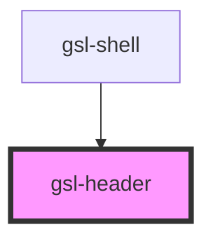

# gsl-header

<!-- Auto Generated Below -->

## Properties

| Property              | Attribute               | Description                                                                                          | Type      | Default                   |
| --------------------- | ----------------------- | ---------------------------------------------------------------------------------------------------- | --------- | ------------------------- |
| `buttonLabelActive`   | `button-label-active`   | Aria label when nav is open                                                                          | `string`  | `'Close navigation menu'` |
| `buttonLabelInactive` | `button-label-inactive` | Aria label when nav is closed                                                                        | `string`  | `'Open navigation menu'`  |
| `logoAlt`             | `logo-alt`              | Optional alt text for the default logo                                                               | `string`  | `'Goddard School logo'`   |
| `logoHref`            | `logo-href`             | Link the logo should direct to                                                                       | `string`  | `'/'`                     |
| `logoSrc`             | `logo-src`              | path to logo asset                                                                                   | `string`  | `undefined`               |
| `navExpanded`         | `nav-expanded`          | controlled by the shell component, expanded state of side nav, to set the state of the toggle button | `boolean` | `false`                   |
| `pageTitle`           | `page-title`            | Page title                                                                                           | `string`  | `undefined`               |
| `sideNavId`           | `side-nav-id`           | The id of the side–nav element so aria‑controls can target it                                        | `string`  | `'gsl-side-nav'`          |

## Events

| Event                 | Description                        | Type                   |
| --------------------- | ---------------------------------- | ---------------------- |
| `gsl:toggle-side-nav` | Emitted when menuButton is toggled | `CustomEvent<boolean>` |

## Dependencies

### Used by

 - [gsl-shell](../gsl-shell)

### Graph

----------------------------------------------

*Built with [StencilJS](https://stenciljs.com/)*
