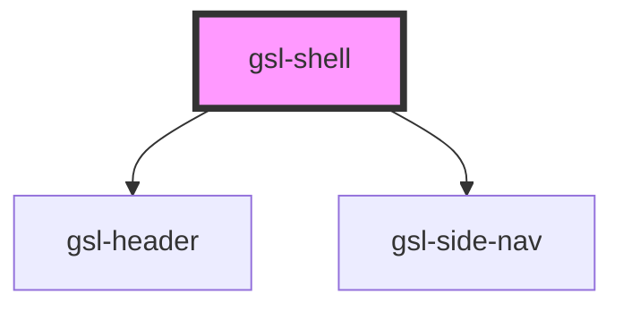

# gsl-shell

<!-- Auto Generated Below -->

## Properties

| Property         | Attribute         | Description | Type               | Default     |
| ---------------- | ----------------- | ----------- | ------------------ | ----------- |
| `currentPath`    | `current-path`    |             | `string`           | `undefined` |
| `logoSrc`        | `logo-src`        |             | `string`           | `undefined` |
| `navigationData` | `navigation-data` |             | `NavigationItem[]` | `[]`        |
| `pageTitle`      | `page-title`      |             | `string`           | `undefined` |

## Events

| Event              | Description | Type                                                                  |
| ------------------ | ----------- | --------------------------------------------------------------------- |
| `gslToggleLock`    |             | `CustomEvent<{ locked: boolean; source: "header" \| "side-nav"; }>`   |
| `gslToggleSidenav` |             | `CustomEvent<{ expanded: boolean; source: "header" \| "side-nav"; }>` |

## Dependencies

### Depends on

- [gsl-header](../gsl-header)
- [gsl-side-nav](../gsl-side-nav)

### Graph

----------------------------------------------

*Built with [StencilJS](https://stenciljs.com/)*
