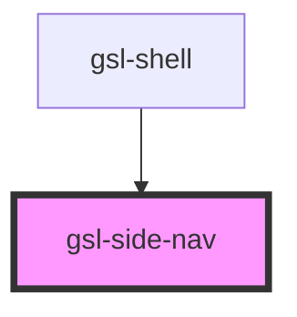

# gsl-side-nav

<!-- Auto Generated Below -->

## Properties

| Property         | Attribute         | Description                                                                                                                                           | Type               | Default     |
| ---------------- | ----------------- | ----------------------------------------------------------------------------------------------------------------------------------------------------- | ------------------ | ----------- |
| `currentPath`    | `current-path`    | String that will open the nav's submenus to the link specified. currently will be used on route navigation. only works with nav links that have hrefs | `string`           | `undefined` |
| `isExpanded`     | `is-expanded`     | expanded state of side nav, controlled by shell component                                                                                             | `boolean`          | `false`     |
| `locked`         | `locked`          | Controlled by shell component, will persist the expanded state on route navigation or reload                                                          | `boolean`          | `false`     |
| `navigationData` | `navigation-data` | Navigation data structure, including nested links and "new/featured" section                                                                          | `NavigationItem[]` | `[]`        |

## Events

| Event         | Description | Type                             |
| ------------- | ----------- | -------------------------------- |
| `gslNavigate` |             | `CustomEvent<{ href: string; }>` |

## Dependencies

### Used by

 - [gsl-shell](../gsl-shell)

### Graph

----------------------------------------------

*Built with [StencilJS](https://stenciljs.com/)*
